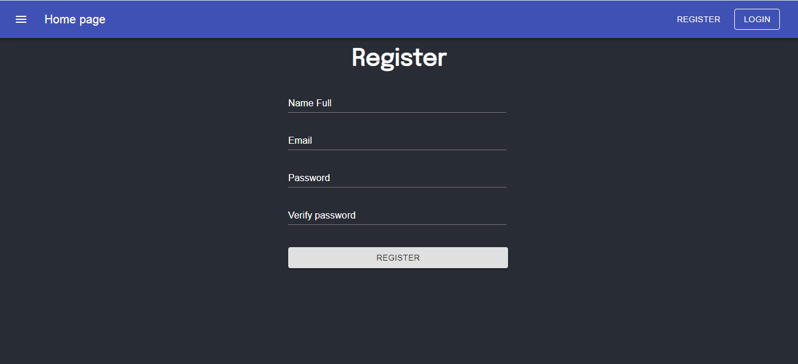

# user-authentication

In this project, I am setting up a basic template to work with user authentication on the MERN stack. Learn how to register user accounts in a [MongoDB](https://www.mongodb.com/es) database, log in to users in the react interface, and verify registered users. Using react hooks and the context API to handle user authentication state management in the interface created with [Material-UI](https://material-ui.com/).


# Preview




# Project Setup

## Clone

Clone this repo to your local machine using

```sh
https://github.com/StyvenSoft/user-authentication.git
```

## install

Auto setup script

```sh
bash setup.sh
```

## Run

Run API server

```sh
cd backend/
npm run dev
```
Frontend on port 3000

```sh
cd frontend/
npm start
```